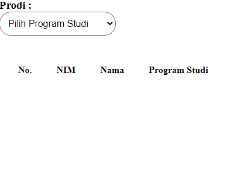
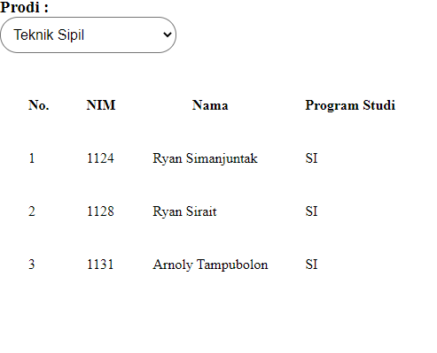

# Pertemuan 5
Tugas Praktikum Pemrograman Web RC Jadwal C Pertemuan 5

Basrunki Siburian_120140007

> Membuat aplikasi web yang dapat menampilkan data mahasiswa ketika pengguna melakukan
perubahan pada pilihan program studi yang tersedia menggunakan bantuan AJAX.
> - Aplikasi terhubung ke database yang memiliki tabel mahasiswa dengan minimal 3 data
yaitu NIM, Nama, dan Program Studi.
> - Terdapat minimal 10 baris data mahasiswa.

Berikut merupakan hasil dari tugas yang dikerjakan

Pertama Kali Dijalankan

Data yang terlihat masih kosong karena belum memilih *option* yang ada

Hasil akhir

Data yang terlihat akan sesuai dengan yang dipilih

